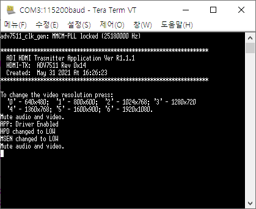

# ADV7511 Zedboard Boards Reference Design Tutorial

## Getting started
This document is based on the requirements below.

- Ubuntu 20.04
- Vivado Design Suite 2019.1
- Xilinx Zedboard

To prevent permission problem, installing everything under home directory is recommended.

## 0. Prerequisites

### 0-1. git
```bash
sudo apt-get install git
```

### 0-2. wine
```bash
sudo apt-get install wine
```

### 0-3. gcc-arm-none-eabi v5.3
The latest version of gcc-arm-none-eabi has some problems with 'Build the HDL Project'. You should remove it with
```bash
sudo apt autoremove gcc-arm-none-eabi
```
You should download compressed file from [here](https://armkeil.blob.core.windows.net/developer/Files/downloads/gnu-rm/gccarmnoneeabi532016q120160330linuxtar.bz2). Download and extract it. After that, add it to the path by
```bash
export PATH=<path_to_extracted_file>/gcc-arm-none-eabi-5_3-2016q1/bin:$PATH
```

### 0-4 setting PATH
You must add Vivado and SDK to the path. Also, you must source the SDK setting.
```bash
export PATH=<path_to_xilinx>/Vivado/bin$PATH
export PATH=<path_to_xilinx>/SDK/bin:$PATH
```

### 0-5 sourcing SDK
You must source SDK's setting64.sh
```bash
source <path_to_xilinx>/SDK/setting64.sh
```

### 1. Download the ADV7511 HDML Transmitter Library
Download the ADV7511 HDML Transmitter Library Installation file from [here](https://www.analog.com/media/en/dsp-hardware-software/software-modules/ADV7511_API_Library.exe). Use the wine to open it in Ubuntu environment.
```bash
cd ~/Downloads
wine ADV7511_API_Library.exe
```
If you didn't change any option during installation, default directory is 
\~/.wine/drive_c/Analog\ Devices/ADV7511_API_Library*

## 2. Build the HDL

### 2-1. Clone the HDL repository
Go to your base workspace directory and clone the HDL repository from [github repository](https://github.com/analogdevicesinc/hdl).
```bash
git clone https://github.com/analogdevicesinc/hdl.git
cd hdl
```

### 2-2. Select your desired branch
The above command clones the 'default' branch, which is the 'master' for HDL. If you want to switch to any other branch you need to checkout that branch.
If you other version of Vivado design suite, you should check [releases](https://github.com/analogdevicesinc/hdl/releases) to find which version of HDI branch to use.
```bash
git status
git checkout hdl_2019_r2
```

### 2-3. Make sure everything is up to date
If this is your first time cloning, you have all the latest source files. If it has been a while, you can simply pull the latest sources using git pull or git rebase if you have local changes.
```bash
git fetch
git rebase origin/hdl_2019_r2
```

### 2-4. Build your desired project
```bash
cd project/adv7511/zed
make
```
After this, you can find system_top.hdf or system_top.xsa file in hdl/project/adv7511/zed/adv7511_zed.sdk

## 3. Build the software
Before build the software, make sure that
- Zedboard is turned on
- Zedboard booting setting is JTAG
- Zedboard and Linux PC are connected with JTAG
- Zedboard and PC are connected with UART
- Baud rate of UART is 115200
- Zedboard and monitor are connected with HDMI
- Monitor is powered on

### 3-1. Clone the building repository
Now, go to your base workspace directory and clone the building repository. After that, go into the project/adv7511 folder
```bash
git clone --recursive https://github.com/analogdevicesinc/no-OS.git
cd no-OS/project/adv7511
```
### 3-2. Select platform
Before build a project, you must set the device to use. Open the app_config.h file in src folder.
```bash
gedit src/app_config.h
```
You can see the c code. Erase the remark icon before the PLATFORM_ZED.
```c
//#define PLATFORM_AC701
//#define PLATFORM_KC705
//#define PLATFORM_VC707
//#define PLATFORM_ZC702
//#define PLATFORM_ZC706
#define PLATFORM_ZED
```
### 3-3 Copy the former files
Copy the hardware design from HDL directory and hdmi transmitter from ADV7511 API library. If you install ADV7511_API_Library without changing installation directory, you can use
```bash
cp <path_to_hdl>/hdl/project/adv7511/zed/adv7511_zed.sdk/system_top* .
cp --recursive /<path_to_adv7511_hdmi_transmitter_library>/Src/TX .
```

if you install adv7511 hdmi transmitter library somewhere else, you can use
```bash
cp --recursive ~/.wine/drive_c/Analog\ Devices/ADV7511_API_Library*/Src/TX .
```

### 3-4 Build and run
```bash
make run
```
After this, you can see the manual is coming out on uart. You can follow that manual to controll the hdmi interface.



For example, if you type in 6, monitor resolution is changed to 1920 x 1080 and you can see default picture appears on monitor. After that, you can see example picture is on your monitor. The example picture is with monitor resolution 1920 x 1080


## 4. References
If you have any problems above, please visit the reference sites below.

- [ADV7511 Xilinx Evaluation Boards Reference Design](https://wiki.analog.com/resources/fpga/xilinx/kc705/adv7511)
- [Building HDL wiki](https://wiki.analog.com/resources/fpga/docs/build)
- [No-OS github wiki](https://github.com/analogdevicesinc/no-OS/wiki)
